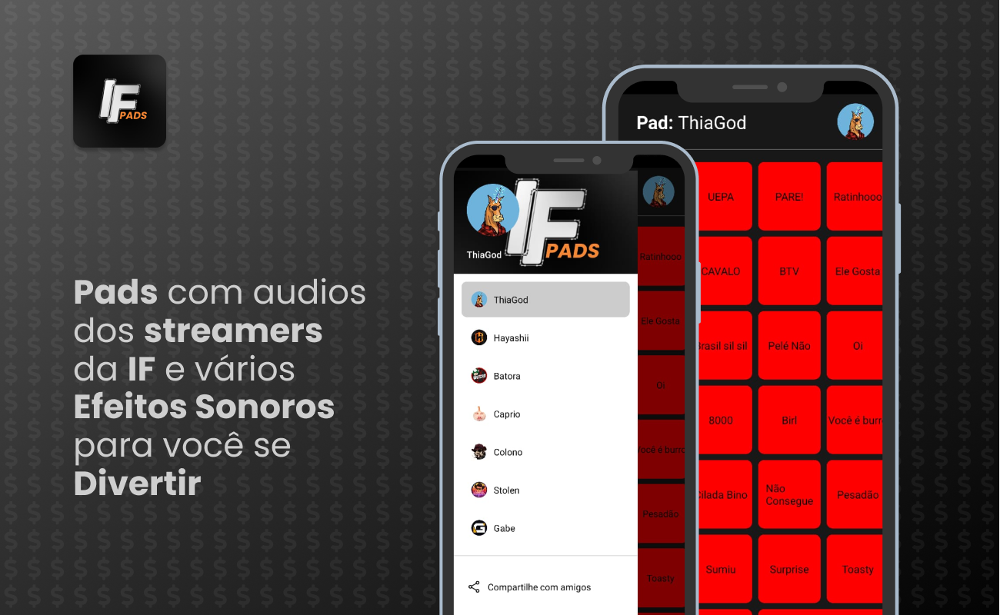

<a href="https://github.com/filipeleonelbatista/ifpads/blob/master/README_EN.md" target="_blank">
  
  Version in English
</a>



# Indice

- [Sobre](#-sobre)
- [Tecnologias](#Tecnologias)
- [Instalação](#Instalação)

## 🔖&nbsp; Sobre

App de audios usados pelos streamers da IF para a Comunidade usar e tem a opção de controle remoto para enviar comandos no chat da live, 
com autenticação da twitch e você pode criar o seu pad customizado com modo noturno e proteção de comandos de teclado 
afim de evitar copiar os audios exclusivos. Usando Google analytics para ver quais audios mais usados pelos visitantes.

[Link do projeto rodando na WEB](https://ifpads.vercel.app/)

[Link da Aplicativo na Google Play](https://play.google.com/store/apps/details?id=com.ifpads.streamers)

## Objetivo

Sempre que assistia os streamers usando os comandos de audios pensei que poderia criar botões para poder usar em momentos engraçados e 
depois a comunidade poder usar isso e enviar comandos para a live pelo app então resolvi tentar desenvolver e ampliar meus conhecimentos. 
Usando Google analytics para ver quais audios mais usados pelos visitantes.

Falo mais [NESTE POST](https://www.linkedin.com/posts/filipeleonelbatista_if-audios-reactnative-activity-6946810710047793152-cRTu?utm_source=share&utm_medium=member_desktop) do meu Linkedin.
 
---
## Tecnologias

Esse projeto foi desenvolvido com as seguintes principais tecnologias:

- [Typescript](https://www.typescriptlang.org/)
- [Google Analytics](https://developers.google.com/analytics?hl=pt-br)
- [Twitch IRC API](https://dev.twitch.tv/)
- [React JS](https://legacy.reactjs.org/docs/getting-started.html)
- [Firebase](https://firebase.google.com/?hl=pt)
- [React Native](https://facebook.github.io/react-native/)
- [Expo](https://expo.io/)

e mais...

---
## Instalação

O projeto roda com [Node.js](https://nodejs.org/) v20+.

Instruções para instalar as dependencias e inicie o projeto.

### Web

```sh
cd ifpads/web
npm i
npx run dev
```

### Mobile

```sh
cd ifpads/phone
npm i
npx run start
```

## API da TWITCH

É possivel que o site esteja fora do ar ou com algum problema então será necessário configurar a api da TWITCH
para poder rodar a aplicação.

Lembre de criar uma instancia na parte de desenvolvimento da twitch e completar com as configurações do autenticador nos arquivos `AuthContext`
nas duas aplicações que fica em `src/context/AuthContext.jsx` colocando o Client ID do seu App criado na area de desenvolvimento da twitch para poder
usar o pacote TMI para enviar comandos no chat.

---

<h3 align="center" >Vamos nos conectar 😉</h3>
<p align="center">
  <a href="https://www.linkedin.com/in/filipeleonelbatista/">
    
  </a>&ensp;
  <a href="mailto:filipe.x2016@gmail.com">
    
  </a>&ensp;
  <a href="https://instagram.com/filipeleonelbatista">
    
  </a>
</p>
<br />
<p align="center">
    Desenvolvido 💜 por Filipe Batista 
</p>
