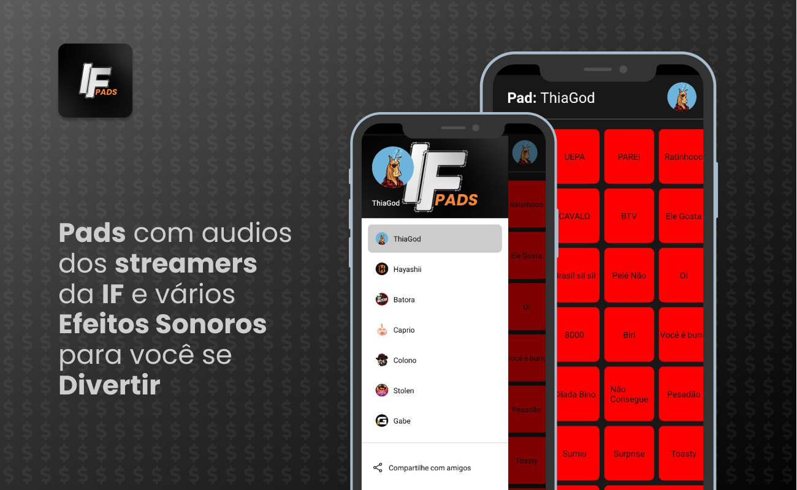

<a href="https://github.com/filipeleonelbatista/ifpads/blob/master/README.md" target="_blank">
  
  Version in Brasilian Portuguese
</a>
</br>
</br>



# Index

- [About](#-about)
- [Technologies](#technologies)
- [Installation](#installation)

## 🔖&nbsp; About

Audio app used by IF streamers for the community to use, with an option for remote control to send commands in the live chat. It includes Twitch authentication, allowing you to create your custom pad with night mode and keyboard command protection to prevent copying exclusive audios. Google Analytics is used to track which audios are most popular among visitors.

[Link to the running project on the WEB](https://ifpads.vercel.app/)

[Link to the app on Google Play](https://play.google.com/store/apps/details?id=com.ifpads.streamers)

## Objective

Whenever I watched streamers using audio commands, I thought I could create buttons to use during funny moments, allowing the community to use this feature and send commands to the live stream via the app. I decided to develop this idea to expand my knowledge. Google Analytics is used to track which audios are most popular among visitors.

I talk more about it [IN THIS POST](https://www.linkedin.com/posts/filipeleonelbatista_if-audios-reactnative-activity-6946810710047793152-cRTu?utm_source=share&utm_medium=member_desktop) on my LinkedIn.
 
---
## Technologies

This project was developed with the following main technologies:

- [Typescript](https://www.typescriptlang.org/)
- [Google Analytics](https://developers.google.com/analytics?hl=en)
- [Twitch IRC API](https://dev.twitch.tv/)
- [React JS](https://react.dev/)
- [Firebase](https://firebase.google.com/)
- [React Native](https://reactnative.dev/)
- [Expo](https://expo.dev/)

and more...

---
## Installation

The project runs with [Node.js](https://nodejs.org/) v20+.

Instructions to install dependencies and start the project:

### Web

```sh
cd ifpads/web
npm i
npx run dev
```

### Mobile

```sh
cd ifpads/phone
npm i
npx run start
```

## API da TWITCH

The site may be down or have some issues, so it will be necessary to configure the TWITCH API to run the application.

Remember to create an instance in the Twitch development section and complete the authenticator configurations in the `AuthContext` files in 
both applications located in `src/context/AuthContext.jsx`, adding the Client ID of your app created in the Twitch development area to use the 
TMI package to send commands in the chat.

---

<h3 align="center">Let's connect 😉</h3>
<p align="center">
  <a href="https://www.linkedin.com/in/filipeleonelbatista/">
    
  </a>&ensp;
  <a href="mailto:filipe.x2016@gmail.com">
    
  </a>&ensp;
  <a href="https://instagram.com/filipeleonelbatista">
    
  </a>
</p>
<br />
<p align="center">
    Developed 💜 by Filipe Batista 
</p>
